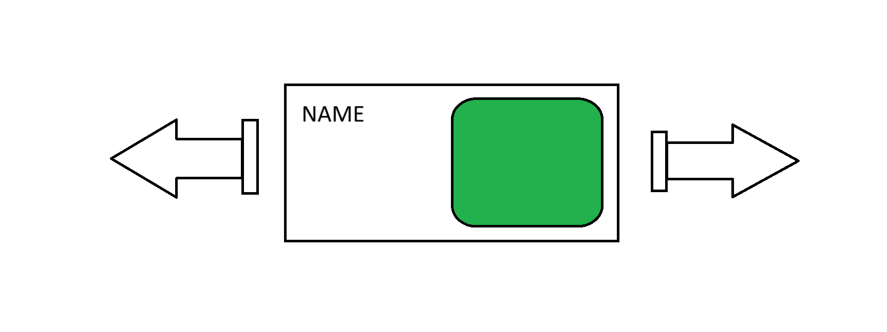

# TUSOK FOR THOUGHT
## Little tidbits of knowledge to act as morsels for human ispiration

### Our website aims to achieve a similar style to a boquet of flowers, but for the sciences and humanities. We plan on showing a wide selection of sciences and humanities that could potentially be your career in the future. Unsure of what something is? Search it and find out what subset of sciences its in. Not there? Contribute your own understanding thorough the user-made articles portal.

## HOW WE'LL DO IT!

### Our website will boast a display that looks both modern and connected to nature. It will bring a sense of verisimilitude to mother Earth in our website that creates an inviting and warm aesthetic.

### Scroll through the wide selection of available topics via the topic gallery! Where each arrow click brings a new type of science or humanities for you to explore in a neat flashcard format. Hover over each flashcard to see a short summary of the topic, or click it to get a more in depth review of the entire field. To accomplish this smooth motion, we will use the versatile programming language that is javascript. A mockup of what it would look like is attatched below.

### Once a card is clicked, it takes you to a short webpage, containing more detailed and thorough information on the field, including what it could be used for in the future!